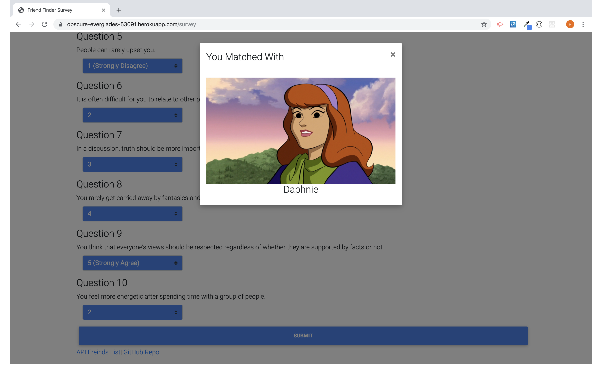

# Friend Finder
Friend Finder is an app that has the user submit their name, photo, and fill out a 10 question survey to match them to with their most likely friend. After the user fills out the survey their answers are compared to every stored *friend* and via a **JavaScript** algorithm, the most compatable friend is chosen and displayed to the user by a **MDBootstrap** modal.  

### This application utilizes three NPM packages
- **Express** for routing
- **Heroku** to host the site
- **Path** to help with route requests

### This application also uses several frameworks including 
- **jQuery**
- **Bootstrap**
- **MDBootstrap**
- **FontAwesome**

### Landing Page

### Survey Page

### Friend Modal

Click [Here](https://obscure-everglades-53091.herokuapp.com/) to try Friend Finder yourself

